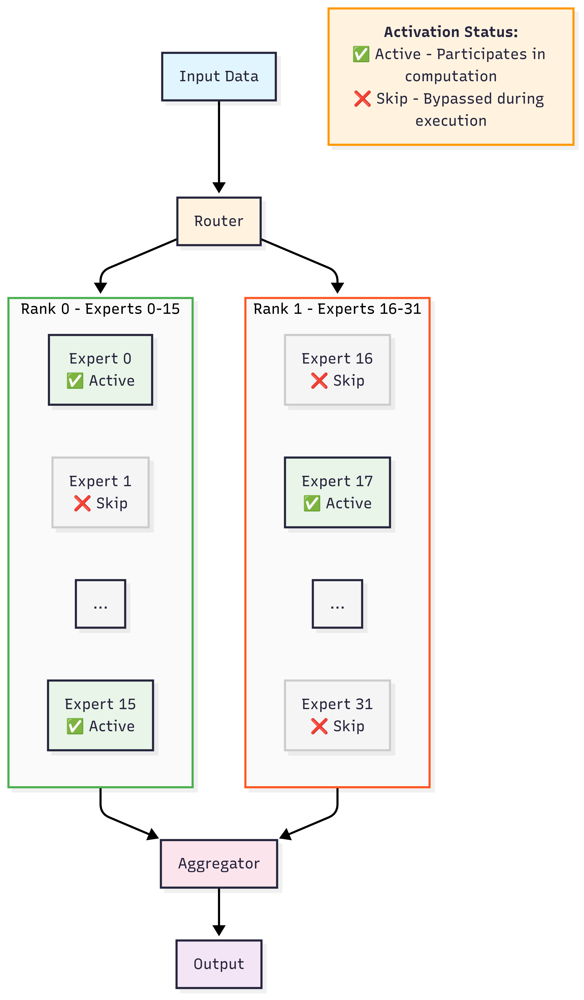
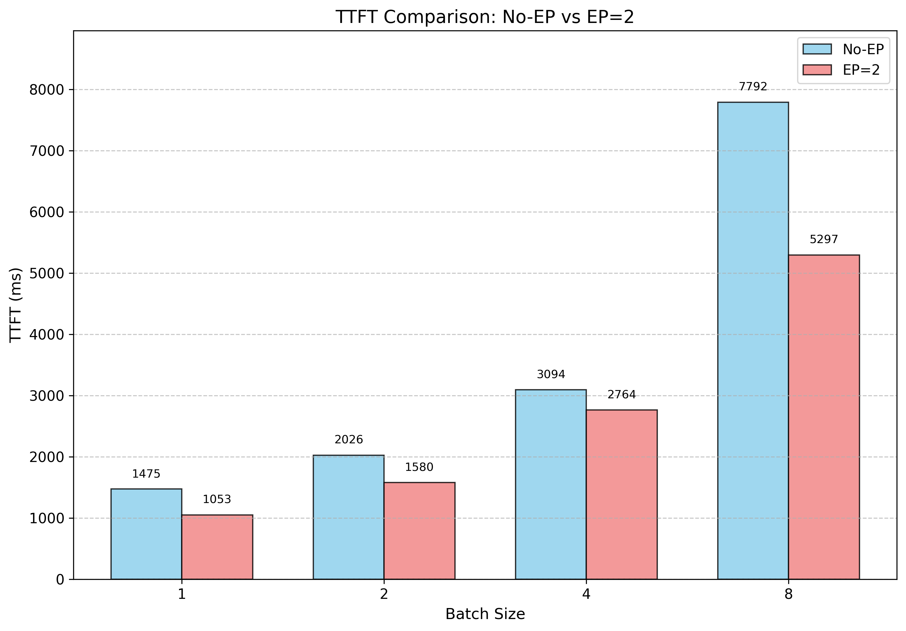
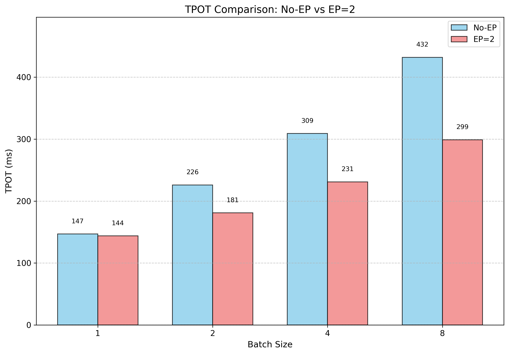

# Running GPT-OSS on Intel Xeon CPUs

GPT-OSS achieves inference speeds that approach human reading speed, thanks to its expert computation method on Intel Xeon CPUs. Unlike GPUs, where all experts are computed in parallel and masking is applied to select active values, CPUs do not have extra FLOPs to compute all experts simultaneously. Instead, GPT-OSS on CPUs computes one expert at a time, avoiding unnecessary calculations for inactive experts. This optimization results in a 3x speed-up compared to computing all experts, making it highly efficient for CPU-based inference.


## Introduction

GPT-OSS is an open-weight model known for its strong reasoning and versatility. Its MoE architecture, while having a large number of parameters, activates only a small subset during inference. This makes it efficient to run on Intel Xeon CPUs, where Expert Parallelism (EP) can further improve performance by distributing the computation of experts across multiple processes.

In this article, we benchmark the bfloat16 version of GPT-OSS-20B ([lmsys/gpt-oss-20b-bf16](https://huggingface.co/lmsys/gpt-oss-20b-bf16)) on Intel 6th Gen Xeon GNR CPUs at GCP C4. Our results demonstrate that gpt-oss model can reach human reading speed on text generation tasks. Additionally, EP improves TPOT (Time per Output Token) by 5%–70% as batch size increases, enabling significantly higher throughput compared to non-parallel setups.


## Expert Parallelism

Expert Parallelism (EP) is a technique used to distribute the computation of experts across multiple NUMA nodes. In the GPT-OSS model, the experts are evenly split and assigned to different NUMA nodes on Intel Xeon CPUs. By leveraging EP, the model can achieve significant speed-ups, especially for large-scale MoE architectures.

<kbd>
  
</kbd>

To enable EP on gpt-oss model in transformers, we just need to pass `tp_plan="auto"` when loading the model. We recommend you to use the command `mpirun -np 2 --map-by ppr:1:numa --bind-to numa` to bind the computation of different experts to different NUMA nodes. This ensures that each NUMA node handles its assigned experts independently, leveraging the locality of memory and computation to improve performance and reduce communication overhead.

`mpirun -np 2 --map-by ppr:1:numa --bind-to numa -genv MASTER_ADDR=127.0.0.1 -genv MASTER_PORT=29500 -genv OMP_NUM_THREADS=<cores_per_numa> python tp_hf.py`

```diff
import os
import torch
from transformers import AutoTokenizer, AutoModelForCausalLM

# The mpirun use PMI_RANK and PMI_SIZE as default env to pass rank and world size.
# We need to set RANK, LOCAL_RANK and WORLD_SIZE which can be recognized by transformers.
os.environ['RANK'] = str(os.environ.get('PMI_RANK', 0))
os.environ['LOCAL_RANK'] = str(os.environ.get('PMI_RANK', 0))
os.environ['WORLD_SIZE'] = str(os.environ.get('PMI_SIZE', 1))

model_id = "lmsys/gpt-oss-20b-bf16"
# Load model with tp_plan="auto" to enable Expert Parallelism
model = AutoModelForCausalLM.from_pretrained(
    model_id,
    dtype=torch.bfloat16,
+    tp_plan="auto"
)
# Prepare input tokens
tokenizer = AutoTokenizer.from_pretrained(model_id)
messages = [
    {"role": "user", "content": "How many rs are in the word 'strawberry'?"},
]
inputs = tokenizer.apply_chat_template(
    messages,
    add_generation_prompt=True,
    tokenize=True,
    return_tensors="pt",
    return_dict=True,
).to(model.device)

generated = model.generate(**inputs, max_new_tokens=100)
print(tokenizer.decode(generated[0][inputs["input_ids"].shape[-1]:]))
```


## Performance Evaluation of Expert Parallelism

To evaluate the performance of Expert Parallelism (EP), we fixed the input and output sequence lengths to 1024 tokens and tested the latency under different batch sizes. The tests were conducted on Intel 6-th Gen Xeon GNR CPUs with and without EP enabled.

The following figures show the performance results for TTFT (Time to First Token) and TPOT (Time per Output Token) under various batch sizes.

<kbd>
  
</kbd>

<kbd>
  
</kbd>


## Conclusion

In the TTFT results, we observed that EP could complete the prefill in 1 second for batch size 1. However, as batch size increases, EP becomes slower than non-EP. This is because non-EP utilizes 1 socket with 3 NUMA nodes, while EP involves only 2 NUMA nodes and limits each process to a single NUMA node. Non-EP benefits from more resources, resulting in better TTFT performance at larger batch sizes.

In the TPOT results, EP demonstrates better performance as batch size increases. By distributing expert computation across multiple NUMA nodes, EP allows each node to process its workload independently. This reduces the computational burden on a single process and improves overall efficiency. EP also leverages memory and computation locality within each NUMA node, minimizing communication overhead and achieving better scalability. Ultimately, EP achieved a throughput of 95 tokens per second.

In the TPOT results, we observed that both EP and non-EP configurations can achieve human reading speed. When the batch size is 1, the TPOT is approximately 150ms. Moreover, EP demonstrates better performance as batch size increases. By distributing expert computation across multiple NUMA nodes, EP allows each node to process its workload independently. This reduces the computational burden on a single process and improves overall efficiency. Additionally, EP leverages memory and computation locality within each NUMA node, minimizing communication overhead and achieving better scalability. Ultimately, EP achieved a throughput of 95 tokens per second when batch size is 64.

Looking ahead, we plan to enable specialized kernels to further accelerate expert computation. These kernels will optimize operations within experts, making GPT-OSS inference even faster on Intel Xeon CPUs.